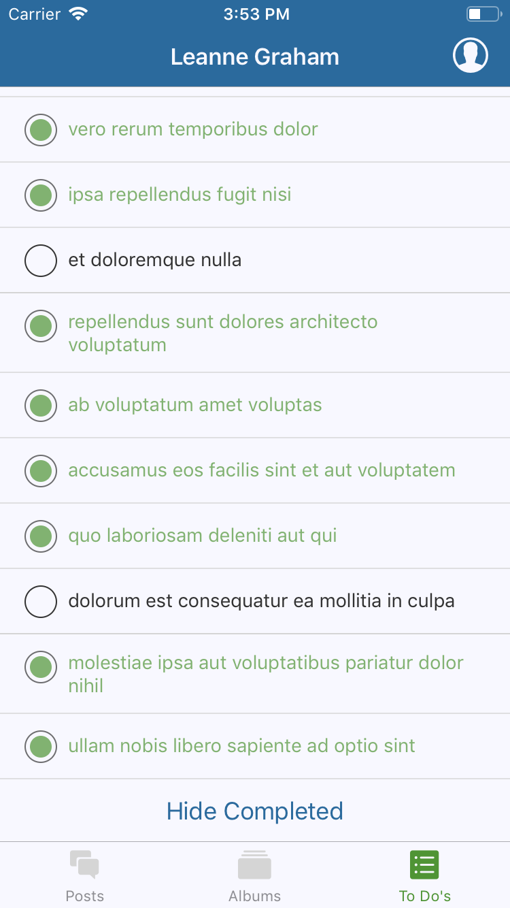

<p align="center">
  <a href="https://expo.io/@robhung/scb-social-networking-app">
    
  </a>
</p>

# SCB Book - Social Network App

## Task

1. Given the public API: https://jsonplaceholder.typicode.com/
2. Write a UI of your choice: iOS, Android or Web.
3. Put the code into a GitHub repository and provide us with a link and instructions on how to start the application.
4. Please, provide your submission as quickly as possible.

## Some further clarification on the task

1. What's the judging criteria?

   - Cleanness of code
   - Ease of use & navigation
   - Look and feel
   - Creativeness

2. We are to decide all the APIs by ourselves? What number of it is expected/preferred?

   - The API should be this: https://jsonplaceholder.typicode.com/
   - It is a simple social network app.
   - Users have posts and photo albums and a todo list
   - Posts have comments.
   - Photo albums have photos.
   - We don’t want to be too restrictive regarding how the data gets presented.
   - An example app could look like (but is not restricted to):
     - Have a top level list of users.
     - Click a user widget and get to the user details page.
     - Have another button to show the address
     - Have a section for photo album
     - Have a section for todo’s
     - Have a section for posts.
     - Each section navigates to the respective details view.
     - Navigating back up the UI tree should be possible.

3. Any preferred types of apps/webs or problem domains? e.g. a timer vs. an info site
   - We would prefer a mobile app over a web app. Otherwise see above. If it runs in an emulator that is fine.

No third-party UI Frameworks allowed.

---

## Run Development or Production via Local Machine

### Install Expo CLI

```bash
npm install -g expo-cli
```

### Install Dependencies

```bash
npm install
```

### Run

```bash
npm start
```

Expo Dev Tools will automatically launch in your browser.

Either follow the prompts in the terminal, or select the prompts via Expo Dev Tools.

Ensure you have your simulator running, or install Expo on your device ([iOS](https://itunes.apple.com/app/apple-store/id982107779) or [Google Play](https://play.google.com/store/apps/details?id=host.exp.exponent&referrer=www)) and scan the QR code using the Expo app (Android) or the Camera app (iOS).

### Testing

Tests can be run with:

```bash
npm test
```

## Run Production via Expo Hosted (Published)

You will need to download the Expo app on [iOS](https://itunes.apple.com/app/apple-store/id982107779) or [Google Play](https://play.google.com/store/apps/details?id=host.exp.exponent&referrer=www).

The project has been published and is hosted on [Expo](https://expo.io/@robhung/scb-social-networking-app). Simply scan the QR code in the link using the Expo app (Android) or the Camera app (iOS).

## Screenshots (iOS 12)

<div>
  
  
  
  
  
  
  
  
  
</div>

## Screenshots (Android 9)

<div>
  
  
  
  
  
  
  
  
  
</div>

## Made using React-Native & Expo CLI

See the [React-Native README](https://github.com/facebook/react-native/blob/master/README.md).

See the [Expo-CLI README](https://github.com/expo/expo-cli/blob/master/README.md).
